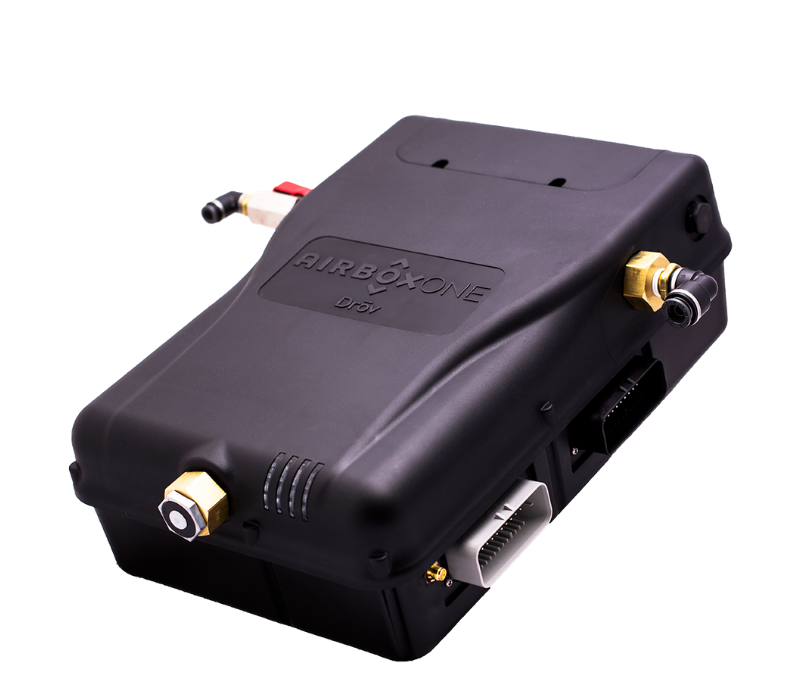

# 🚀 Autonomous Vehicle Monitoring System

## 📌 Overview

An intelligent embedded system designed to monitor and report the real-time health status of commercial vehicles. The system integrates multiple sensors to track vehicle dynamics, environmental conditions inside refrigerator units, and tire pressure, while enabling automated inflation/deflation based on load and pressure. It supports both remote admin monitoring and real-time driver notifications through a mobile app.

## 🛠️ Technologies Used

- MCU / Platform : STM32L4, i.mx7.
- Sensors : Accelerometer , GPS, TPMS Pressure sensors , Temperature & Humidity sensors, Weight sensors 
- Communication : BLE, CAN, UART, I2C, SPI, MQTT, Wi-Fi, Ethernet, LTE
- OS/Framework : FreeRTOS, YOCTO, Linux
- Tools : STM32CubeIDE, nRF Connect , Wireshark, J-Link 

## 🧩 Features / Modules

- Automatic tire inflation & deflation system based on tire pressure values.
- Real time temperature, pressure, Accelerometer, GPS, RTC & ABS data logging mechanism to remote AWS cloud.
- Real time Accident/threat detection and camera operation accordingly.
- Real time vehicle tracking with GPS and LTE based trip start-end detection mechanism.
- Communication with mobile application over TCP/IP protocol for real time data logging.

## 🔍 Responsibilities

Your role and what you contributed:
- Designed UART driver for STM32 using HAL
- Integrated FreeRTOS timers for scheduling
- Performed field testing and debugging with oscilloscope

## ⚙️ Client : Drov Technologies 

- [Product](https://www.drovtechnologies.com/products/airboxone)

> 

## 📈 Outcome / Achievements

- 💡 Supported TCP/IP communication between product device & mobile application to give real time updates and alerts to remote driver.
- ✅ Excelled troubleshooting and debugging techniques to remotely access device and fix them in field at runtime.
- 🏆 Fixed the critical RTC time corruption issue by developing alternate mechanisms like NTP / manual sync at real time to avoid false time trigger.
- 💡 Integrated the temperature monitoring sensor in the product as well as send the real time data to aws cloud to monitor the temperature inside the refrigerator trucks.
- Worked on the revised hardware version of this product to make it more robust, efficient and cost effective.
- Validated various IC functionalities w.r.t feature in the new hardware design and assured its proper working. 

## 📅 Timeline

`Jun 2021 – April 2024`

## 🔖 Tags

`#IoT` `#Firmware` `#BLE` `#FreeRTOS` `#STM32` `#Wi-Fi` `#YOCTO` `#i.mx7`

