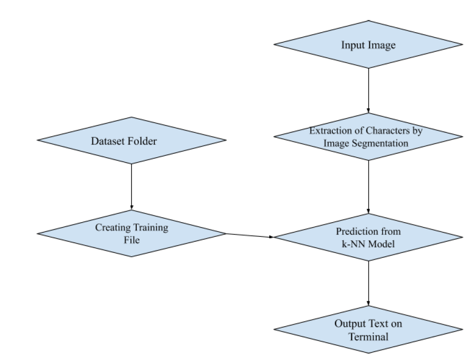
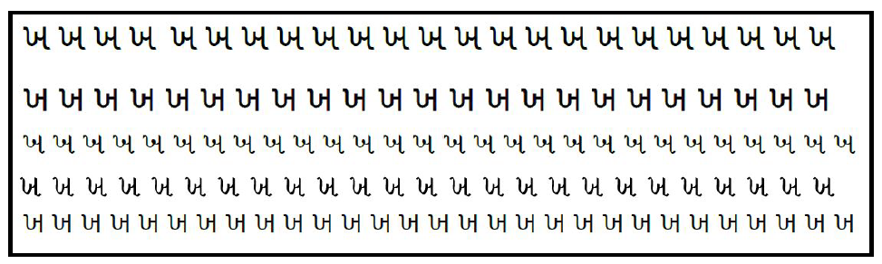
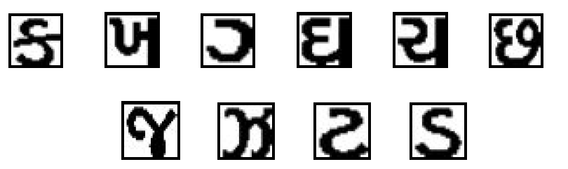
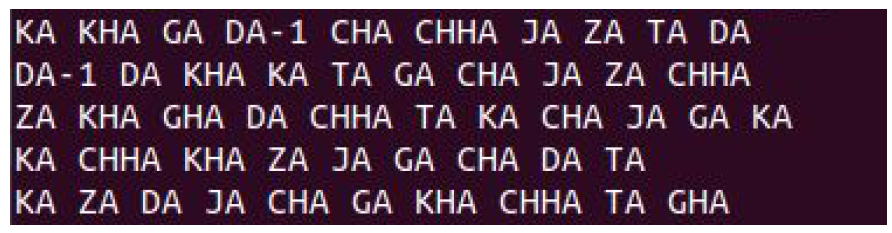

# 📝 GUJARATI CHARACTER RECOGNITION SYSTEM

## 📌 Overview

A Python-based OCR (Optical Character Recognition) solution built specifically for the Gujarati script using image preprocessing and the k-Nearest Neighbor (k-NN) machine learning algorithm. This system recognizes characters from scanned printed documents, helping bridge the technology gap for Indian regional scripts.

  

## 🛠️ Tech/Hardware Used

  

- **Programming**: Python

- **Libraries**: OpenCV, NumPy, Matplotlib, Scikit-learn

- **Machine Learning**: k-Nearest Neighbor (k-NN)

- **Custom Components**:
	- Feature vector generator
	- Image segmentation functions (`crp_text()`)

  

## 🧩 Features / Modules

- **Full Gujarati Alphabet Recognition**
	Recognizes characters from ‘ka’ to ‘gna’ using custom dataset.
	
- **Character Segmentation**
	Segments input images by scanning lines and characters using horizontal and vertical stripes.
	
- **Custom Training Dataset**
	Built manually with 150+ image samples per character.
	
- **Feature Extraction and Vectorization**
	Prepares labeled training vectors for the k-NN classifier.
	
- **Real-Time Prediction Using k-NN**
	Classifies new character images based on nearest matches in the training set.

  
## 🔍 Responsibilities

  

- 🖼️ **Image Preprocessing Pipeline**  
	Implemented grayscale conversion, thresholding, and segmentation.
	
- 📁 **Training Dataset Design**  
	Collected and labeled Gujarati characters for training.
	
- 🔍 **Algorithm Evaluation**  
	Experimented with template matching, SSIM, MSE, CNN, and Tesseract before selecting k-NN.
	
- 🧪 **Custom ML Pipeline in Python**  
	Wrote `feature_creation.py` and `app_code.py` to handle training and live classification.
	
- 🛠️ **Manual Feature Engineering**  
	Developed logic for generating character-specific feature vectors for k-NN.

  
## ⚙️ Diagrams

- [Flowchart of OCR Pipeline]  

> 

  

- [Character Dataset]  

> 

  

- [Character Extraction]  

> 

  - [Resultant Output]  
> 
## 📈 Outcome / Achievements

- ✅ Achieved 75% recognition accuracy for printed Gujarati characters  

- 🧠 Successfully avoided complex/dependency-heavy OCR libraries like Tesseract  

- 📦 Built a modular, lightweight and locally trainable recognition system  

- 🚀 Validated ability to scale with more characters and adapt to other Indian languages  

- 📉 Identified and documented key challenges with handwritten and similar-shaped characters

## 📅 Timeline

`Jan 2021 – May 2021`

  
## 🔖 Tags

`#OCR` `#Gujarati` `#kNN` `#Python` `#ImageProcessing` `#MachineLearning` `#OpenCV` 