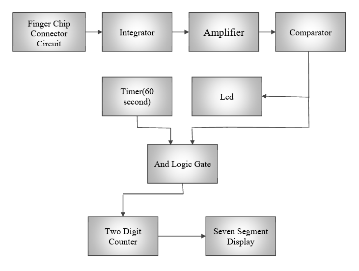
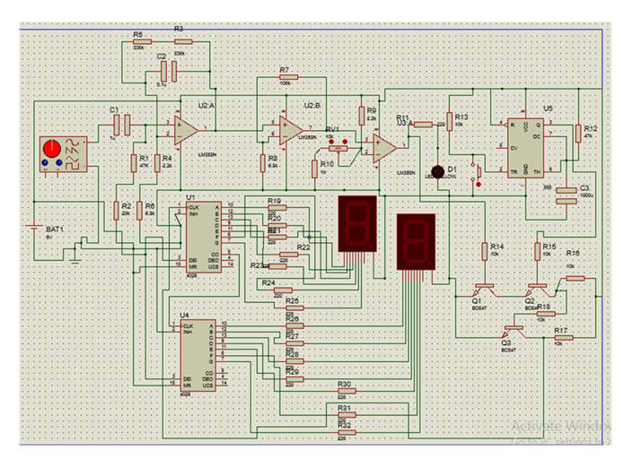
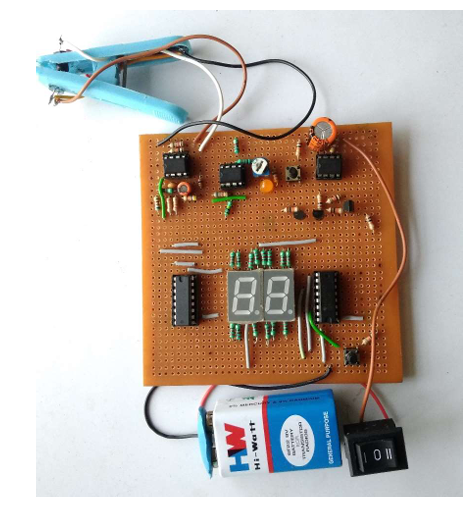

# 🚀HEART BEAT DETECTION AND MEASUREMENT SYSTEM 

## 📌 Overview

A handy module for Heart beat Detection and Monitoring which no only detects heart pulses but also counts it and displays it on the seven segment display. A cost effective solution for Health Measurements.

## 🛠️ Tech/Hardware Used

- Hardware : IR Transmitter and receiver , LM358 , 555 timer, 4026 IC , 7 Segment Display, Battery, DMM , Soldering gun and ion.
- Tools : Proteus PCB Designing and Simulation tool. 
- Communication : Hardware peripherals based using analog circuits.

## 🧩 Features / Modules

- **Infrared Light-Based Pulse Sensing**  
	- Detects heartbeat using the variation in IR light absorbed by hemoglobin in the blood.
    
- **Analog to Digital Pulse Conversion**  
    Converts analog IR signals into rectangular digital pulses representing heartbeat rhythm.
    
-  **Counter-Based Pulse Counting**  
    Uses digital counter ICs to count the number of pulses in a given time window.
    
-  **Time-Gated Counting Mechanism**  
    Implements a 60-second gate timer using logic ANDing to allow counting only within a 1-minute window.
    
-  **Real-Time BPM Display**  
    Displays the pulse count (in beats per minute) on a **7-segment display**.
    
- **Compact Modular Design**  
    Designed as a small, standalone hardware module with integrated sensing and display.

## 🔍 Responsibilities

- 🔧 **Signal Acquisition from IR Sensor Module**  
    Investigated how to reliably obtain an analog pulse signal from the IR transmitter–receiver pair of the finger clip module.
    
- 📊 **Signal Analysis with Digital Storage Oscilloscope (DSO)**  
    Used an oscilloscope to observe signal waveforms and identify noise, irregular pulse patterns, and weak responses.
    
- 🔀 **Signal Conditioning with Filters and Integrators**  
    Designed a two-stage conditioning circuit:
    
    - High-pass filter to remove the DC offset
    - Integrator circuit to smoothen the rapidly changing waveform and reduce high-frequency noise
    
- ⚖️ **Comparator Threshold Adjustment for Varying Blood Thickness**  
    Introduced a **variable resistor** to dynamically adjust the comparator reference voltage based on different user conditions (e.g., thicker blood causing weaker pulses).
    
- 🧪 **Breadboard Prototyping and Debugging**  
    Repeatedly tested the system on a breadboard and identified limitations such as op-amp slew rate constraints during amplification.
    
- 📈 **Adaptive Design Thinking and Problem Solving**  
    Applied physical, electronic, and physiological insights to improve the accuracy and reliability of pulse detection for different subjects.

## ⚙️ Diagrams  

- [Block Diagram]

> 

- [Circuit Diagram]

> 

- [PCB component Placement Diagram]

> 

- [PCB Component Soldering Diagram]

> 
## 📈 Outcome / Achievements

- - ✅ **Successfully Captured Reliable Heartbeat Signals**  
    Achieved consistent detection of heartbeat waveforms from the IR sensor module after extensive signal conditioning and hardware modifications.
    
- 🔬 **Overcame IR Signal Noise and Reflection Issues**  
    Improved signal fidelity by physically modifying the IR LED beam angle and tuning receiver alignment — a practical solution not found in datasheets.
    
- 🎛️ **Implemented Dynamic Comparator Reference Control**  
    Designed an adaptive thresholding mechanism using a variable resistor to accommodate variations in blood thickness and individual physiology.
    
- 🧪 **Validated Design with Multi-User Testing**  
    Verified the system with different users and observed consistent BPM readings after calibration, demonstrating robustness of the design.
    
- 🔧 **Designed a Modular and Interpretable Hardware System**  
    Created a compact prototype with discrete functional blocks: sensor input → analog conditioning → comparator → pulse counter → 7-segment display.
    
- 📚 **Gained Practical Experience in Biomedical Signal Processing**  
    Developed deeper understanding of filtering, op-amp limitations (slew rate), and real-world signal behavior — bridging theory and hardware realities. 

## 📅 Timeline

`Jun 2020 – Dec 2020`

## 🔖 Tags

`#Analog` `#CircuitDesign` `#Timer` `#opAmp` `#sevenSegmentDisplay` `#IR` `#Soldering`

